# quickecs
Another simple and effective ECS deployment

## Introduction

### API

This is a simple ECS deployment tool that is designed to be easy to use and easy to understand, just for the purpose of deploying ECS services.
This service is designed to be stateless, written in Python and uses the FastAPI/uvicorn framework. The project is build with `uv`.

### Build

#### Building the image locally

To build the image, you can run the following command:

```bash
docker build -t gentle_api -f gentle_api/Dockerfile .
```

#### Running the image locally
```base
docker run -it -p 8000:8000 gentle_api
```

#### Tagging the image for ECR
```bash
# docker tag gentle_api:latest <account_id>.dkr.ecr.us-west-2.amazonaws.com/<repo_name>:<tag>, e.g.:
docker tag gentle_api:latest 277403261980.dkr.ecr.us-west-1.amazonaws.com/gentle_api:latest
```

#### Pushing the image to ECR
Login to ECR. Make sure you have the AWS CLI installed and configured with the necessary permissions:
```bash
aws ecr get-login-password --region us-west-1 | docker login --username AWS --password-stdin 277403261980.dkr.ecr.us-west-1.amazonaws.com
```

Push the image to ECR:
```bash
docker push 277403261980.dkr.ecr.us-west-1.amazonaws.com/gentle_api:latest
```
>> Note: Make sure to replace the account ID with your own and the ECR has been created. To create it without creating the whole ECS infra, please deploy the states bucket below and run:

```bash
cd terraform/environments/dev
terraform init -var-file ../../tfvars/dev.tfvars
terraform apply -lock=false -target module.ecr -var-file ../../tfvars/dev.tfvars
cd -
```


## Deploying the service to ECS

### Create the Application Environment

```bash
cd terraform
terraform init
terraform plan \
    -var image=277403261980.dkr.ecr.us-west-2.amazonaws.com/gentle_api:latest
```
Make sure to review the plan and ensure that the resources are correct.


### Deploy the Application Environment

Starting from the bucket to save the state files:

```bash
cd terraform/state_buckets
terraform init -var-file ../tfvars/dev.tfvars
terraform apply -var-file ../tfvars/dev.tfvars
cd -
```

Then, deploy the VPC:

```bash
cd terraform/environments/dev
terraform init -var-file ../tfvars/dev.tfvars
terraform apply terraform/environments/dev/vpc.tf
```

Then, deploy the ECS cluster:

```bash
terraform apply -var image=277403261980.dkr.ecr.us-west-2.amazonaws.com/gentle_api:latest
```

### Justfile

Use `just` to automate the deployment process. The `justfile` contains the commands to deploy the service to ECS.

```bash
Available recipes:
    build        # Build docker image
    deploy-all   # Deploy the application, from building the image to deploying the ECS service
    deploy-ecs   # Create the ECS cluster and service with the new image
    deploy-image # Build and push docker image to ECR
    destroy-all  # Destroy all resources
    fmt
    help         # This recipe
    just-doc
    push         # Push docker image to ECR
    tfsec
````

### AWS Infra diagram

```mermaid
architecture-beta
    service internet(logos:aws)[internet]
    group aws(logos:aws)[AWS]
    service ecs_cluster(logos:aws-ecs)[ECS_Cluster] in aws
    service igw(logos:aws-igw)[Internet Gateway] in aws
    group vpc(logos:aws-vpc)[VPC] in aws
    

    group public_subnetes(logos:aws-subnet)[Public_Subnets] in vpc

    group public_subnets_a1(logos:aws-subnet)[Subnet in AZ1] in public_subnetes
    group public_subnets_a2(logos:aws-subnet)[Subnet in AZ2] in public_subnetes
    group public_subnets_a3(logos:aws-subnet)[Subnet in AZ3] in public_subnetes

    service alb1(logos:aws-alb)[ALB in AZ1] in public_subnets_a1
    service alb2(logos:aws-alb)[ALB in AZ2] in public_subnets_a2
    service alb3(logos:aws-alb)[ALB in AZ3] in public_subnets_a3

    group private_subnets(logos:aws-subnet)[Private_Subnets] in vpc

    group private_subnets_a1(logos:aws-subnet)[Subnet in AZ1] in private_subnets
    group private_subnets_a2(logos:aws-subnet)[Subnet in AZ2] in private_subnets
    group private_subnets_a3(logos:aws-subnet)[Subnet in AZ3] in private_subnets

    service ecs_node1(logos:aws-ecs)[ECS_Node in AZ1] in private_subnets_a1
    service ecs_node2(logos:aws-ecs)[ECS_Node in AZ2] in private_subnets_a2
    service ecs_node3(logos:aws-ecs)[ECS_Node in AZ3] in private_subnets_a3

    alb1:L -- R:ecs_node1
    alb1:L -- R:ecs_node2
    alb1:L -- R:ecs_node3

    alb2:L -- R:ecs_node1
    alb2:L -- R:ecs_node2
    alb2:L -- R:ecs_node3

    alb3:L -- R:ecs_node1
    alb3:L -- R:ecs_node2
    alb3:L -- R:ecs_node3

    alb1:L -- R:igw
    alb2:L -- R:igw
    alb3:L -- R:igw

    igw:L -- R:internet
```

